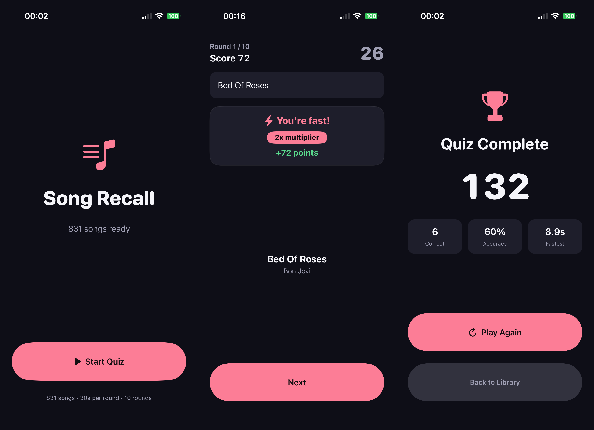

# Song Recall

A private, local-only iPhone music-memory quiz. Song Recall reads songs already stored in your Music library, plays each one from the beginning, and rewards faster correct recall with more points.

**Your library, audio, guesses, and scores never leave your device.** No accounts, no analytics, no streaming, no network calls.

<p align="center">
  
</p>

## Features

- **Local Music library** — reads playable songs from Apple Music via MediaPlayer; cloud-only and DRM-protected tracks are excluded.
- **10 random rounds** (or every track when your library has fewer than 10) with a 30-second timer per round.
- **Free-text guessing** with normalization for case, punctuation, and diacritics — "queen bohemian rhapsody" matches "Queen - Bohemian Rhapsody".
- **Autocomplete** that searches the full catalog with a 400 ms debounce; tapping a suggestion submits your answer.
- **Speed-based scoring** with a "You're fast! 2x multiplier" celebration for answers within 5 seconds.
- **Answer reveal** after every round so you always learn the song you missed.
- **Full accessibility support** — VoiceOver labels, Dynamic Type up to accessibility-XXXL, Reduce Motion, 48 pt touch targets.

## How scoring works

For a correct answer: **10 points + 1 point per remaining second**, doubled when you answer within the first 5 seconds (25 or more seconds left on the clock). Wrong answers deduct 5 points, skips deduct 10, and your score never goes below 0.

## Getting started

### Prerequisites

- macOS with **Xcode 26 or later**
- An iOS 26 simulator (for example `iPhone 17`) or a connected iPhone

### Build and run

1. Clone the repository and open the project:

   ```sh
   open src/SongRecall.xcodeproj
   ```

2. Select the **SongRecall** scheme and an iOS 26 simulator (or your iPhone).
3. Press **Run** (⌘R).

The first launch explains Music access; on a real iPhone, grant it and add local, downloadable songs to your Music library. On the simulator you can preview the full flow with the built-in stub library (see Testing).

### Command-line build

```sh
xcodebuild \
  -project src/SongRecall.xcodeproj \
  -scheme SongRecall \
  -destination 'platform=iOS Simulator,name=iPhone 17' \
  -derivedDataPath .build/DerivedData \
  build
```

## Testing

Unit and UI tests:

```sh
xcodebuild \
  -project src/SongRecall.xcodeproj \
  -scheme SongRecall \
  -destination 'platform=iOS Simulator,name=iPhone 17' \
  -derivedDataPath .build/DerivedData \
  test
```

The suite covers the domain engine, scoring boundaries and timer races, catalog mapping, autocomplete ranking, and full user journeys. UI tests run against a deterministic stub library (no personal media required). Additional launch-argument stubs:

- `-uitest-library ready|empty|denied|restricted|notDetermined` — stub the Music library
- `-uitest-round-duration 2` — shorten rounds so timeout paths run fast

## Project structure

```
src/
  SongRecall.xcodeproj/   Xcode project (source root = src/)
  SongRecall/             app source
    App/                  entry point and composition root (AppModel)
    Domain/               pure quiz engine, scoring, answer matching, suggestions
    Services/             MediaPlayer, AVFoundation, clock, random adapters
    Features/             Home, Permission, Quiz, Results feature views and view models
    DesignSystem/         theme tokens, haptics, artwork accents
    Resources/            asset catalog (app icon, accent color)
  SongRecallTests/        unit tests (and test doubles)
  SongRecallUITests/      UI tests
```

The Xcode project uses file-system-synchronized folders: files added under those directories are picked up automatically.

## Privacy

- Single permission: **Music library access** (NSAppleMusicUsageDescription).
- No network entitlements, no third-party packages, no external music or metadata services.
- Song audio and metadata are read from the device and never transmitted or logged.

See `docs/` for the full architecture, quiz rules, design system, and decision log. The MVP roadmap and status live in `docs/ROADMAP.md`.
